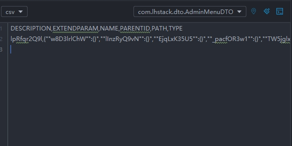
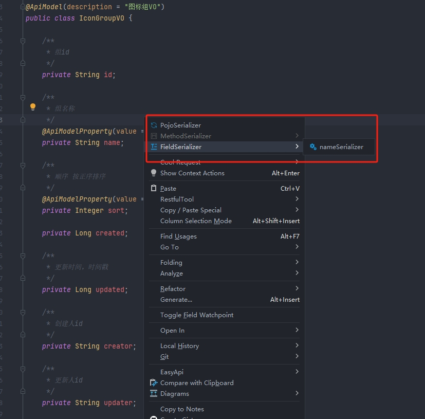

# PojoSerializer
## 介绍
```markdown
1. 支持将对象序列化
2. 支持在方法上右键将方法返回值,入参序列化,支持泛型
3. 支持选中指定的对象序列化,此功能支持Java,Kotlin,Scala等Jvm语言
4. 拥有生成历史记录
5. 可通过历史记录定位到被生成的对象
```
## 使用方式,需安装Tools插件,此插件可联系作者获得
`lhstack@foxmail.com`

## example






